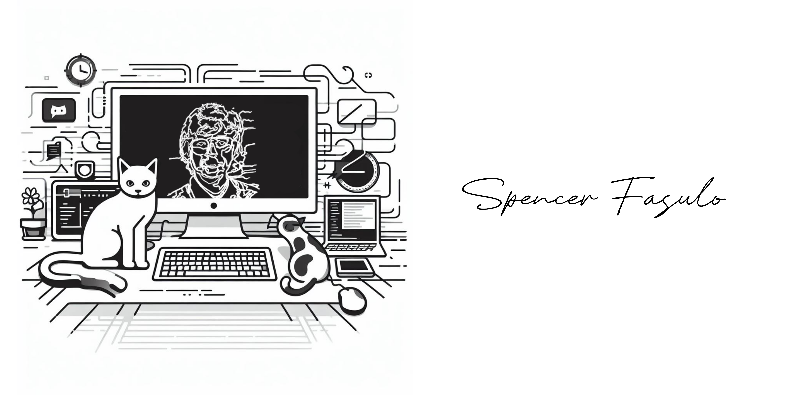
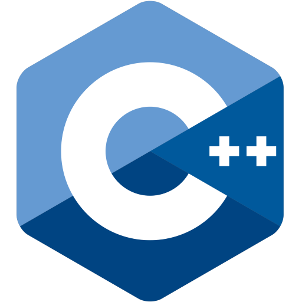
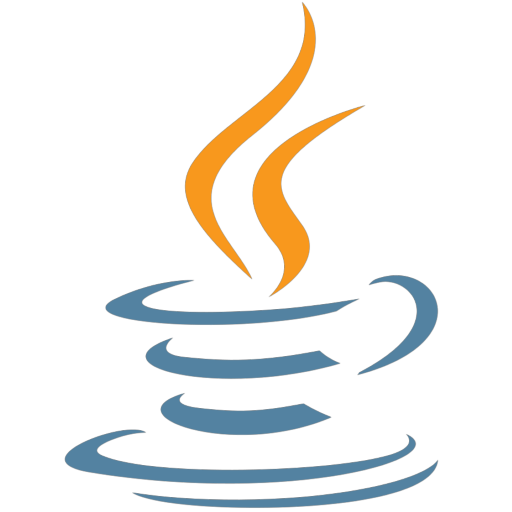

Hi! My name is Spencer and I'm a third-year Computer Science student at the University of Florida! Many of my interests fall in disciplines of computing, though I am particularly interested in developing software that enhances the lives of people. In seeking to qualify those benefits, I plan to pursue a minor in Public Relations. I'm also interested in AI, cybersecurity awareness, and human-computer interaction.

---

## 🔭 I’m currently working on
+ [**CASMM**](https://github.com/CEN3031Team10f/Emerald-Project02-10f): A cloud-based programming interface designed for elementary students, developed by the University of Florida and Texas A&M University with support from the National Science Foundation
+ [**My Personal Website**](https://fasulo.one): To showcase the software and tools I've worked on

## ✨ Future Work
+ **Quotable**: A web app where friend groups can create and contribute to group "quote boards"

## 🦭 Something Cool
In Fall 2022, I made a small platformer called [Sea Lion Scramble](https://www.spencer.fasulo.one/sls/) for an introductory course in game development. Though that field is not for me, I still enjoyed making this game. I hope you will give it a spin, keeping an eye out for easter eggs and paying no mind to the bugs that appeared when I built the game for web 😅

## 👨‍💻 Technical Skills

Proficient:

  
  
  
  

Intermediate:

  
  
  
  
  
  

Some Experience:

  
  
  

## 🌱 I’m currently learning

    

+ Principles of programming lanaguages and how to write a recursive-decent compiler
+ Relational algebra & SQL
+ Principles of computer organization

## 📊 GitHub Stats

<!--
**spfncer/spfncer** is a ✨ _special_ ✨ repository because its `README.md` (this file) appears on your GitHub profile.

Here are some ideas to get you started:

-...
- 👯 I’m looking to collaborate on ...
- 🤔 I’m looking for help with ...
- 💬 Ask me about ...
- 📫 How to reach me: ...
- 😄 Pronouns: ...
- ⚡ Fun fact: ...
-->
